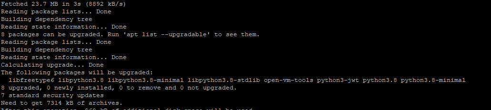

# Stake Wars: Episode III. Challenge 1

Buat dompet Shardnet Anda & gunakan NEAR CLI.

## Useful links

Wallet:

> - [Wallet](https://wallet.shardnet.near.org/)

Explorer:

> - [Explorer](https://explorer.shardnet.near.org/)

Official documentation:

> - [Validator setup instructions](https://github.com/near/stakewars-iii)

gabung official Discord:

> - https://discord.gg/XVsBbZGqUt

## Minimum Hardware Requirements

- 4-Core CPU with AVX support
- 8GB RAM DDR4
- 500GB Disk

## Update dan Upgrade Software

```
sudo apt update && sudo apt upgrade -y
```



## Install Developer Tools, Nodejs dan NPM

```
curl -sL https://deb.nodesource.com/setup_18.x | sudo -E  -

sudo apt install build-essential

sudo apt install nodejs

PATH="$PATH"
```


## Cek version `Nodejs` dan `NPM`

```
node -v
```

> v18.6.0

```
npm -v
```

> 8.13.2

## Install NEAR-CLI

Install NEAR-CLI.

```
sudo npm install -g near-cli
```

## Ubah NEAR Environment ke Shardnet

```
export NEAR_ENV=shardnet
```

```
echo 'export NEAR_ENV=shardnet' >> ~/.rc
```


## Useful Command

- Cek List Proposals

  Pada bagian ini kalian bisa melihat list proposal apakah diterima atau ditolak (kalian bisa cek nanti setelah membuat validator).

  - Cek semua proposals

    ```
    near proposals
    ```

  - Cek spesific proposals

    Ganti `nama` dengan nama wallet kalian (contoh : stakewar)

    ```
    near proposals | grep nama.factory.shardnet.near
    ```

- Cek Validators Aktif

  Pada bagian ini kalian bisa melihat list validators yang sedang aktif (Kalian bisa cek ini saat validator kalian sudah status aktif).

  - Cek semua validators aktif

    ```
    near validators current
    ```

  - Cek spesific validators aktif

    Ganti `nama` dengan nama wallet kalian (contoh : stakewar)

    ```
    near validators current | grep nama.factory.shardnet.near
    ```

- Cek Validators Next

  Pada bagian ini kalian bisa melihat validators yang telah diterima proposalnya dan akan menjadi aktif pada epoch selanjutnya (Jika proposal sudah diterima, maka akan muncul dibagian ini nanti setelah epoch sebelumnya selesai).

  - Cek semua validators next

    ```
    near validators next
    ```

  - Cek spesific validators next

    Ganti `nama` dengan nama wallet kalian (contoh : stakewar)

    ```
    near validators next | grep nama.factory.shardnet.near
    ```

## [Setup and Run your Node | challenge 2](./challenge.md)
