## Setup Wallet dan Run Validator `(Challenge 002)`

## Useful links

Wallet:

> - [Wallet](https://wallet.shardnet.near.org/)

Explorer:

> - [Explorer](https://explorer.shardnet.near.org/)

Official documentation:

> - [Validator setup instructions](https://github.com/near/stakewars-iii)

gabung official Discord:

> - https://discord.gg/XVsBbZGqUt

## Cek Spesifikasi (Supported/Not Supported)

```
lscpu | grep -P '(?=.*avx )(?=.*sse4.2 )(?=.*cx16 )(?=.*popcnt )' > /dev/null \
&& echo "Supported" \
|| echo "Not supported"
```

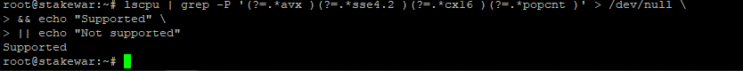

Jika sudah muncul `Supported`, Lanjut ke nex step).

## Install Developer Tools

```
sudo apt install -y git binutils-dev libcurl4-openssl-dev zlib1g-dev libdw-dev libiberty-dev cmake gcc g++ python docker.io protobuf-compiler libssl-dev pkg-config clang llvm cargo
```

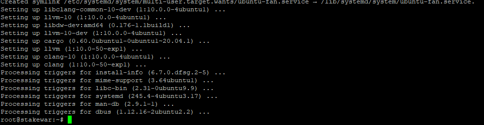

## Install Python pip

```
sudo apt install python3-pip
```

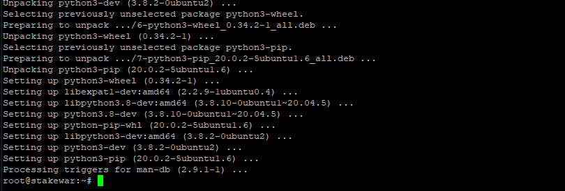

## Set Configuration

```
USER_BASE_BIN=$(python3 -m site --user-base)/bin
export PATH="$USER_BASE_BIN:$PATH"
```

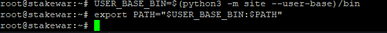

## Install Building Environment

```
sudo apt install clang build-essential make
```

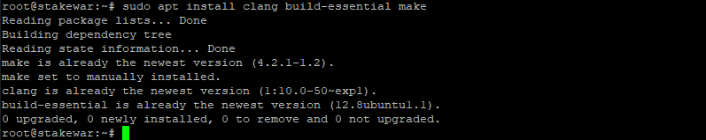

## Install Rust dan Cargo

```
curl --proto '=https' --tlsv1.2 -sSf https://sh.rustup.rs | sh
```

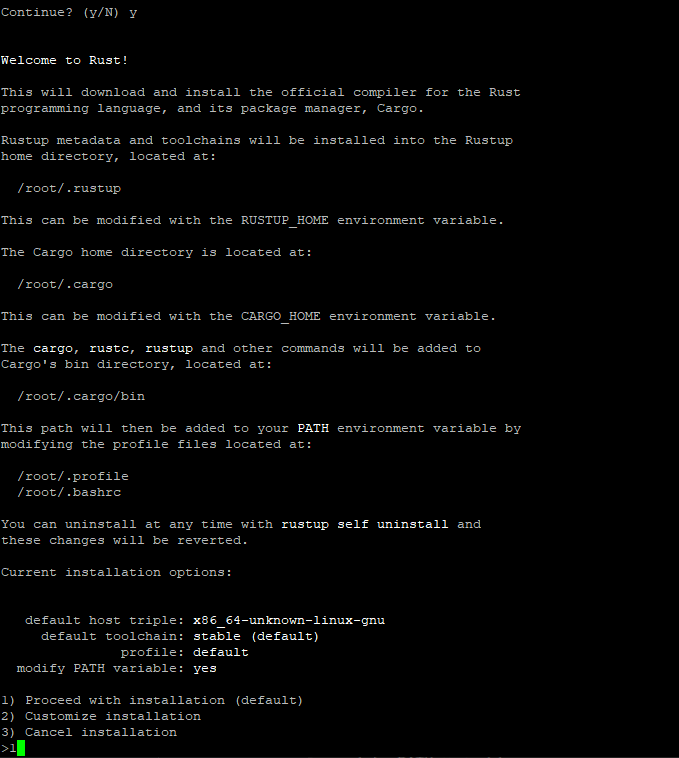
Press y dan enter
Pilih 1 dan enter

## Source the Environment

```
source $HOME/.cargo/env
```

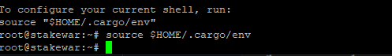

## Clone `nearcore` Project, Clone Repository

```
git clone https://github.com/near/nearcore
cd nearcore
git fetch
```

## Checkout Commit

```
git checkout c1b047b8187accbf6bd16539feb7bb60185bdc38
```

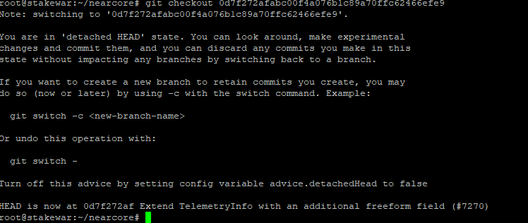

## Compile `nearcore` Binary

```
cargo build -p neard --release --features shardnet
```

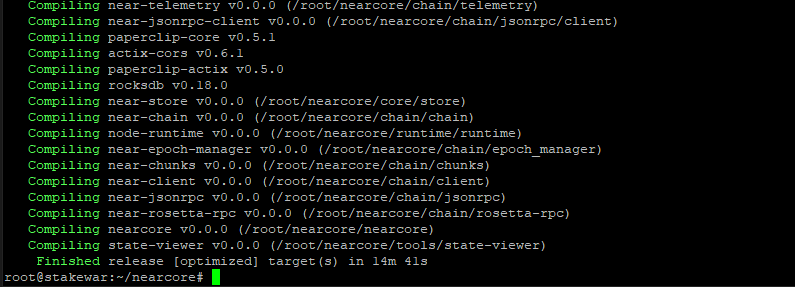
Proses ini membutuhkan waktu yang cukup lama, jadi kalian perlu bersabar.

## Inisialisasi Working Directory

Lakukan ini agar NEAR Node kalian bekerja dengan lancar.

- Delete old `genesis.json`

```
rm ~/.near/genesis.json
```

- Download new `genesis.json`

```
./target/release/neard --home ~/.near init --chain-id shardnet --download-genesis
```

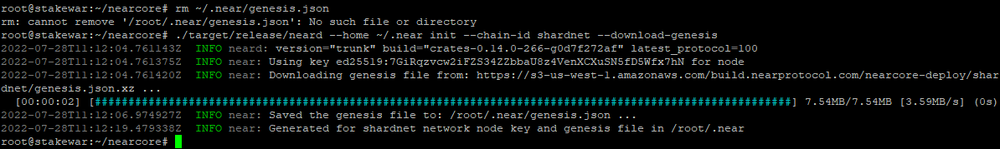

- Menggunakan Snapshot `(Optional)`

Install `AWS-CLI`

```
sudo apt-get install awscli -y
```

Download Snapshot

```
cd ~/.near
# download
aws s3 --no-sign-request cp s3://build.openshards.io/stakewars/shardnet/data.tar.gz .
# tar
tar -xzvf data.tar.gz
# Hapus data
rm -rf data.tar.gz
```

## Replace `config.json`

```
rm ~/.near/config.json
wget -O ~/.near/config.json https://s3-us-west-1.amazonaws.com/build.nearprotocol.com/nearcore-deploy/shardnet/config.json

```

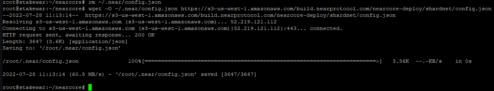

## Jalankan Node

Pada bagian ini kalian harus menunggu download headers ke 100% dan kemudian baru melakukan sinkronisasi block. \_Jangan sampai close tab sebelum itu selesai, jika download sudah selesai 100% silahkan hentikan log dengan menekan `CTRL + C`.

```
cd ~/nearcore
./target/release/neard --home ~/.near run
```

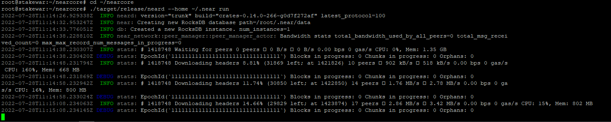

## Membuat Service

```
sudo tee /etc/systemd/system/neard.service > /dev/null <<EOF
[Unit]
Description=NEARd Daemon Service
[Service]
Type=simple
User=$USER
#Group=near
WorkingDirectory=$HOME/.near
ExecStart=$HOME/nearcore/target/release/neard run
Restart=on-failure
RestartSec=30
KillSignal=SIGINT
TimeoutStopSec=45
KillMode=mixed
[Install]
WantedBy=multi-user.target
EOF
```

## Aktifkan Service

```
sudo systemctl daemon-reload
sudo systemctl enable neard
sudo systemctl start neard
```

Jika kamu mengalami masalah pada `neard.service` kalian bisa lakukan perintah berikut :

```
sudo systemctl stop neard
sudo systemctl daemon-reload
sudo systemctl start neard
```

## Cek Log

```
journalctl -n 100 -f -u neard
```

kalian bisa install `ccze` dengan command dibawah ini agar log kalian enak diliat.

```
sudo apt install ccze
```

command dibawah ini untuk melihat log kalian lebih enak dilihat.

```
journalctl -n 100 -f -u neard | ccze -A
```

## Menghubungkan Wallet ke NEAR-CLI dan Generate Validator Key

Pada bagian ini kalian harus memasukkan shardnet wallet kalian untuk menjalankan validatornya, kalian bisa ikuti caranya dibawah ini.

## Lakukan autorisasi wallet

```
near login
```

# Copy Link untuk Autorisasi ke Browser kalian

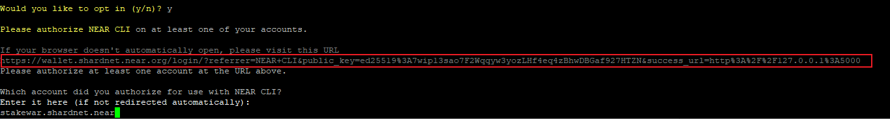

# Create wallet

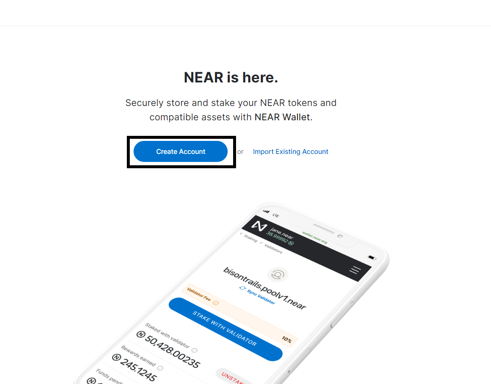

# Masukkan nama wallet (Foto hanya contoh)

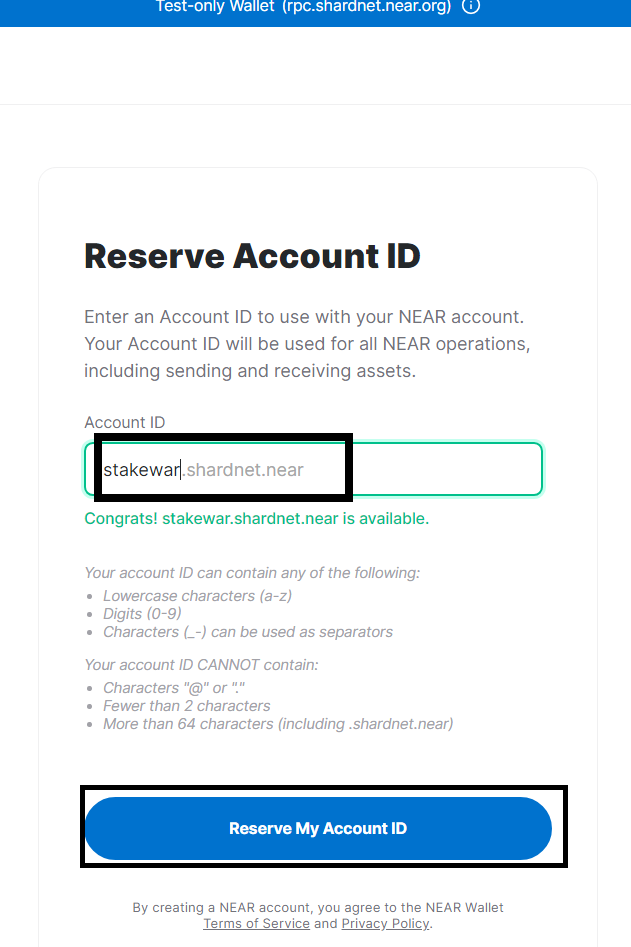

# Simpan Phrase dan Verify Phrase

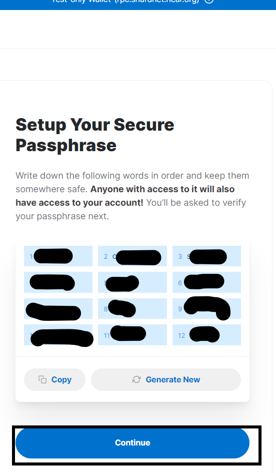

# Kemudian masukkan Phrase yang sudah disimpan tadi

# Klik Next dan Beri akses ke `NEAR-CLI` dengan klik `connect`

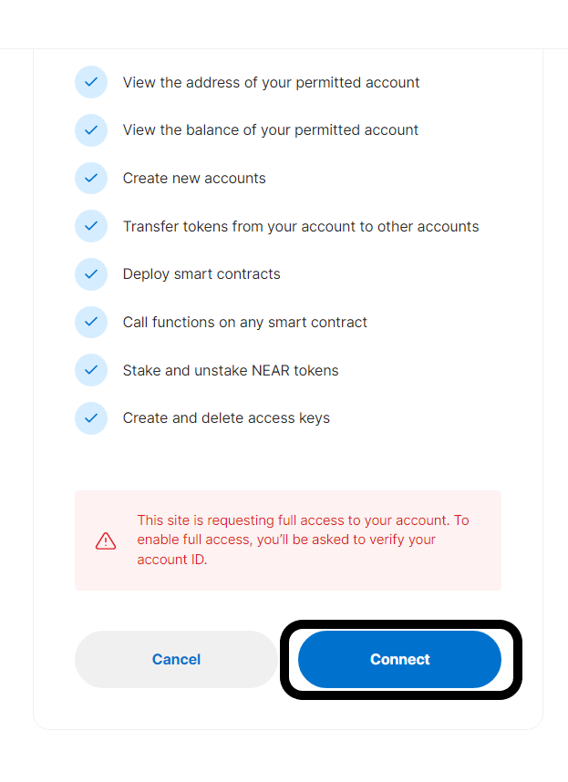

# Lalu masukkan `Account ID` kalian dan klik confirm (contoh : stakewar.shardnet.near). `stakewar` bisa diganti dengan nama wallet kalian.

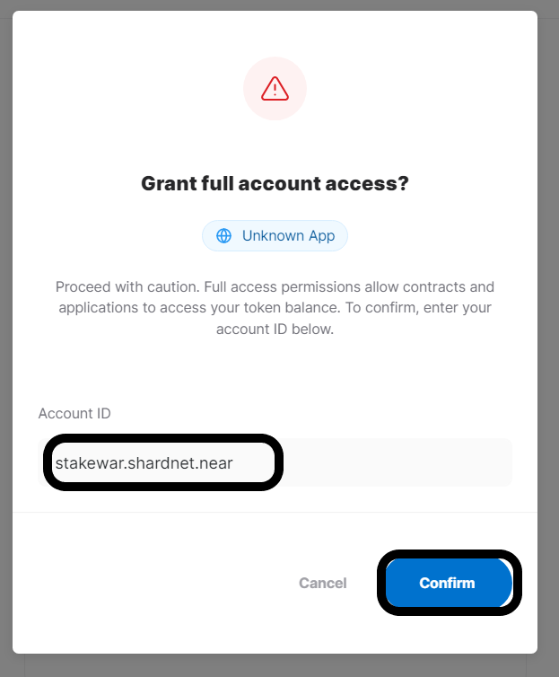

# Setelah Memberi Akses, Kalian akan melihat gambar berikut.

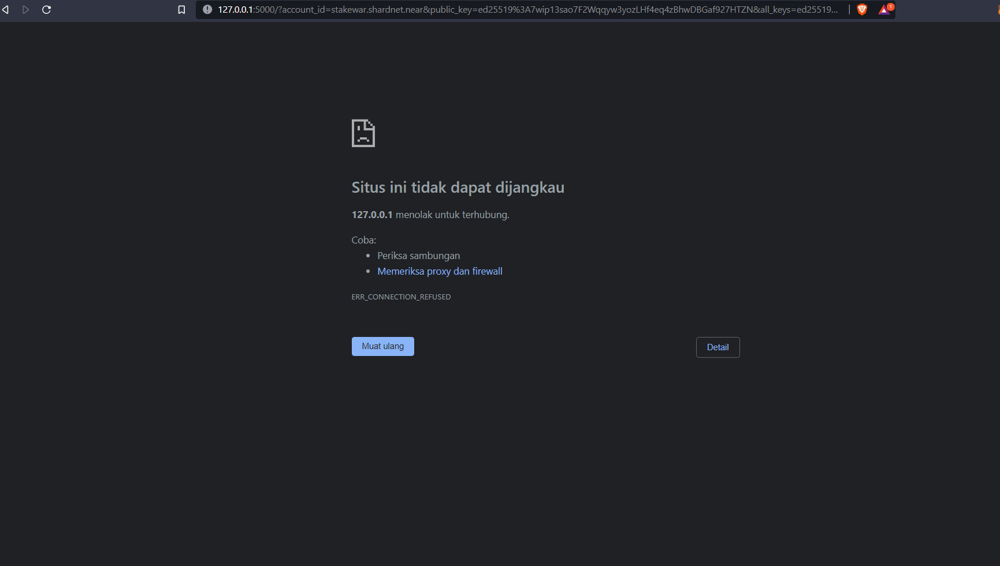

jika sudah muncul gambar tersebut lanjut next step.

# Kembali ke VPS dan masukkan `Account ID` yang sudah kalian buat tadi lalu enter

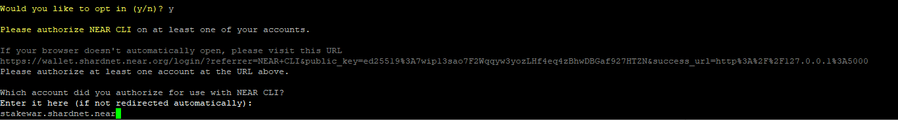

# Generate Key untuk `validator_key.json`

Ganti nama dengan nama wallet kalian (Contoh : stakewar).

```
near generate-key nama.factory.shardnet.near
```

## Lalu pindahkan file `validator_key.json` ke folder `.near`

Ganti nama dengan nama wallet kalian seperti cara sebelumnya.

```
cp ~/.near-credentials/shardnet/nama.factory.shardnet.near.json ~/.near/validator_key.json
```

## Kemudian ganti kata `private_key` ke `secret_key` dibagian `validator_key.json` file

```
nano ~/.near/validator_key.json
```

Setelah di ubah, kemudian tekan `CTRL + X + Y` enter

## Simpan `node_key.json` dan `validator_key.json`

- Copy isi dari file `node_key.json` dan simpan kedalam notepad

```
cat ~/.near/node_key.json
```

- Copy isi dari file `validator_key.json` dan simpan kedalam notepad

```
cat ~/.near/validator_key.json
```

#### Menjadi Validator

Untuk menjadi validator dan masuk ke dalam set validator aktif, minimal harus memenuhi kriteria keberhasilan.

- Node harus sudah dalam full sinkron.
- `validator_key.json` harus ditempatkan yang benar.
- Kontrak validator harus sama dengan `public_key` di `validator_key.json`
- `account_id` harus disetel ke contract id staking pool
- Harus ada delegasi yang cukup untuk memenuhi jumlah seat minimum. Lihat jumlah seat [disini](https://explorer.shardnet.near.org/nodes/validators).
- Proposal harus sudah diajukan dengan melakukan ping ke contract validator kalian.
- Setelah Proposal disetujui (accepted) validators harus menunggu 2-3 epoch untuk menjadi validator aktif.
- Setelah menjadi validator, validator harus menghasilkan lebih dari 90% block yang ditugaskan.

Cek running status dari validator node. Jika `Validator` sudah muncul, maka pool sudah terpilih didalam validators list saat ini.

## Lanjut ke Challenge 003

[Mounting Staking Pool](./challenge3.md)
