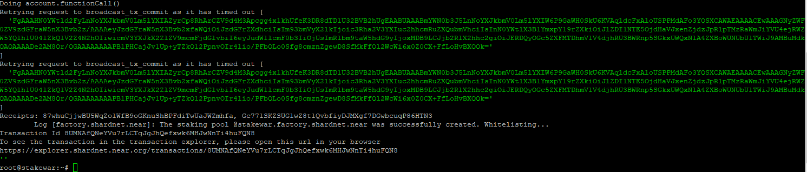

## Mounting Staking Pool `(Challenge 003)`

membuat validator yang akan dijalankan pada shardnet.

## Useful links

Wallet:

> - [Wallet](https://wallet.shardnet.near.org/)

Explorer:

> - [Explorer](https://explorer.shardnet.near.org/)

Official documentation:

> - [Validator setup instructions](https://github.com/near/stakewars-iii)

gabung official Discord:

> - https://discord.gg/XVsBbZGqUt

## Membuat Staking Pool Contract

```
near call factory.shardnet.near create_staking_pool '{"staking_pool_id": "nama_wallet", "owner_id": "nama.shardnet.near", "stake_public_key": "public_key_kalian", "reward_fee_fraction": {"numerator": 5, "denominator": 100}, "code_hash":"DD428g9eqLL8fWUxv8QSpVFzyHi1Qd16P8ephYCTmMSZ"}' --accountId="nama.shardnet.near" --amount=30 --gas=300000000000000
```

`nama_wallet` ganti dengan nama wallet kalian (contoh : stakewar).

`nama.shardnet.near` ganti nama dengan nama wallet kalian (sama seperti diatas) dan `accountId` juga sama.

`public_key_kalian` ganti dengan `public_key` wallet kalian menggunakan command dibawah ini.

```
cat ~/.near/validator_key.json | jq .public_key
```

`--amount=30` kalian bisa ubah jumlah stake NEAR kalian dari 30 ke berapapun yang kalian mau (karena 30 adalah minimum stakenya), 1 wallet memiliki 500 NEAR tapi lebih baik kalian sisakan NEAR (lebih banyak lebih baik) untuk membayar gas fee nantinya. Namun untuk memastikan berapa NEAR yang dibutuhkan, kalian bisa cek seat price [disini](https://explorer.shardnet.near.org/nodes/validators).

## Jika sudah selesai, Maka hasilnya seperti Berikut ini



## Cek validators kalian apakah sudah muncul atau tidak di explorer

https://explorer.shardnet.near.org/nodes/validators

## Useful Command

Jangan lupa untuk ganti `nama` dengan nama wallet kalian (contoh : stakewar) dan `jumlah` ganti dengan angka yang akan kalian input (contoh : `1` dalam bentuk NEAR untuk stake atau untuk unstake `1000000000000000000000000`ini dalam jumlah `yoctoNEAR`).

##### Mengubah commission

Kalian bisa mengubah commission validator kalian dengan jumlah tertentu, command dibawah ini kalian akan mengubahnya ke 3% atau ubah angka 3 pada bagian `"numerator": 3` sesuai keinginan kalian.

```
near call nama.factory.shardnet.near update_reward_fee_fraction '{"reward_fee_fraction": {"numerator": 3, "denominator": 100}}' --accountId nama.shardnet.near --gas=300000000000000
```

##### Deposit dan Stake NEAR

`jumlah_NEAR` ganti dengan angka saja dalam bentuk NEAR (contoh : `--amount 1`).

Command:

```
near call nama.factory.shardnet.near deposit_and_stake --amount jumlah_NEAR --accountId nama.shardnet.near --gas=300000000000000
```

##### Unstake NEAR

`jumlah_yoctoNEAR` ganti dengan angka saja dalam bentuk yoctoNEAR (contoh : `'{"amount": "1000000000000000000000000"}'`).

> 1 NEAR = 1000000000000000000000000 yoctoNEAR

Jalankan command berikut untuk unstake:

```
near call nama.factory.shardnet.near unstake '{"amount": "jumlah_yoctoNEAR"}' --accountId nama.shardnet.near --gas=300000000000000
```

Untuk unstake semua NEAR jalankan command ini:

```
near call nama.factory.shardnet.near unstake_all --accountId nama.shardnet.near --gas=300000000000000
```

##### Withdraw

Unstaking membutuhkan waktu 2-3 epoch agar bisa di withdraw ke akun wallet kalian.

Command untuk withdraw dengan jumlah tertentu dalam bentuk `yoctoNEAR`:

```
near call nama.factory.shardnet.near withdraw '{"amount": "jumlah_yoctoNEAR"}' --accountId nama.shardnet.near --gas=300000000000000
```

Command untuk withdraw semuanya:

```
near call nama.factory.shardnet.near withdraw_all --accountId nama.shardnet.near --gas=300000000000000
```

##### Ping

Ping adalah memperbarui laporan dan update staking balances untuk delegator kalian. Ping harus tetap dilaporkan setiap epoch agar rewards saat ini tetap terupdate dan kalian bisa lakukan Challenges 006 agar bisa melakukan ping selama 5 menit sekali.

Command:

```
near call nama.factory.shardnet.near ping '{}' --accountId nama.shardnet.near --gas=300000000000000
```

Balances Total Balance Command :

```
near view nama.factory.shardnet.near get_account_total_balance '{"account_id": "nama.shardnet.near"}'
```

##### Staked Balance

Command:

```
near view nama.factory.shardnet.near get_account_staked_balance '{"account_id": "nama.shardnet.near"}'
```

##### Unstaked Balance

Command:

```
near view nama.factory.shardnet.near get_account_unstaked_balance '{"account_id": "nama.shardnet.near"}'
```

##### Available for Withdrawal

Kamu hanya bisa withdraw token NEAR dari kontrak jika sudah unlocked.

Command:

```
near view nama.factory.shardnet.near is_account_unstaked_balance_available '{"account_id": "nama.shardnet.near"}'
```

##### Pause / Resume Staking

###### Pause

Command:

```
near call nama.factory.shardnet.near pause_staking '{}' --accountId nama.shardnet.near
```

###### Resume

Command:

```
near call nama.factory.shardnet.near resume_staking '{}' --accountId nama.shardnet.near
```

## Lanjut Challenge 004

[Membuat Monitoring Node Status](./challenge4.md)
