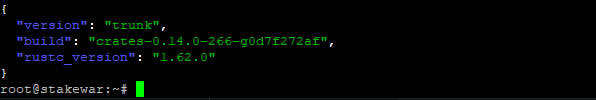

## Membuat Monitoring Node Status `(Challenge 004)`

membuat monitoring node

## Install jq

```
sudo apt install curl jq
```

## Cek versi node kalian

```
curl -s http://127.0.0.1:3030/status | jq .version
```



- Cek Delegators dan Stake

ganti `nama` dengan nama wallet kalian.

```
near view nama.factory.shardnet.near get_accounts '{"from_index": 0, "limit": 10}' --accountId nama.shardnet.near

```

- Cek Block Produced

Ganti `nama` dengan nama wallet kalian.

```
curl -s -d '{"jsonrpc": "2.0", "method": "validators", "id": "dontcare", "params": [null]}' -H 'Content-Type: application/json' 127.0.0.1:3030 | jq  '.result.current_validators[] | select(.account_id | contains ("nama.factory.shardnet.near"))'
```

- Cek Reason Validator Kicked

Ganti `nama` dengan nama wallet kalian.

```
curl -s -d '{"jsonrpc": "2.0", "method": "validators", "id": "dontcare", "params": [null]}' -H 'Content-Type: application/json' 127.0.0.1:3030 | jq -c '.result.prev_epoch_kickout[] | select(.account_id | contains ("nama.factory.shardnet.near"))' | jq .reason
```

## Cek Sinkronisasi

Pastikan status `syncing` adalah `false` agar validators kalian tidak tertinggal block. Jika masih `true` maka node kalian masih belum sepenuhnya tersinkron.

```
curl -s http://127.0.0.1:3030/status | jq .sync_info
```
